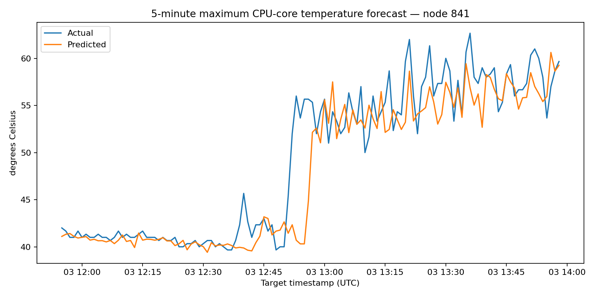
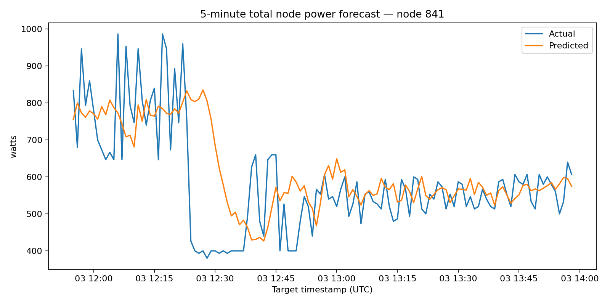

# ML Thermal & Power Predictor

[](https://github.com/susheelcs/ml-thermal-power-predictor/actions/workflows/tests.yml)


A reproducible time-series machine-learning project that forecasts **maximum
CPU-core temperature** and **total node power** five minutes ahead from real
HPC telemetry.

The project combines system telemetry, leakage-aware temporal feature
engineering, chronological evaluation, model comparison, command-line
inference, automated tests, and published experiment artifacts.

## Results

The final models were evaluated on an untouched chronological test period of
**1,488 rows** across 12 nodes. Ridge regression was selected by validation
RMSE after comparison with persistence, Random Forest, Extra Trees,
HistGradientBoosting, and XGBoost.

| Five-minute forecast | Selected model | MAE | RMSE | R² | Persistence RMSE | RMSE reduction |
|---|---:|---:|---:|---:|---:|---:|
| Maximum CPU temperature | Ridge | **1.19 °C** | **2.02 °C** | **0.921** | 2.27 °C | **11.0%** |
| Total node power | Ridge | **57.43 W** | **81.16 W** | **0.816** | 103.63 W | **21.7%** |

Additional test-set interpretation:

- Temperature predictions were within **±1 °C for 60.5%**
  and **±2 °C for 84.0%** of rows.
- Power predictions were within **±50 W for 56.0%** and
  **±100 W for 81.4%** of rows.
- Compared with persistence, Ridge reduced temperature MAE by
  **7.1%** and power MAE by **19.1%**.





Full metrics, model comparisons, predictions, residual plots, and feature
importance files are under [`reports/`](reports/).

## High-temperature event proxy

For analysis only, a high-temperature event was defined as a five-minute-ahead
target at or above **69.33 °C**, the 90th percentile of the
combined training and validation targets.

| Metric | Score |
|---|---:|
| Precision | 78.8% |
| Recall | 55.8% |
| F1 | 65.3% |
| Accuracy | 90.7% |

This threshold is a **statistical proxy**, not a hardware thermal limit or a
safety recommendation.

## Dataset

The source is the public **M100 ExaData** collection from CINECA's Marconi100
Tier-0 supercomputer. It includes production telemetry such as node
temperatures, CPU power, frequencies, loads, and system/workload information.

This repository includes a compact processed subset derived from the March
2021 archive:

- **10,068 rows**
- **12 anonymized nodes**
- **839 continuous one-minute timestamps per node**
- **2021-03-03 00:00–13:58 UTC**
- selected IPMI and Ganglia metrics

Source references:

- Paper: https://doi.org/10.1038/s41597-023-02174-3
- March 2021 archive (`21-03.tar`): https://doi.org/10.5281/zenodo.7589131

The code is MIT-licensed. The included derived data remains subject to CC BY
4.0 attribution; see [`DATA_LICENSE.md`](DATA_LICENSE.md).

### Why `data/raw/` contains no dataset files

The original `21-03.tar` archive is intentionally excluded because it is large.
This repository already includes the compact experiment-ready dataset under
`data/processed/`, so training, evaluation, and prediction do not require the
raw archive. Download the raw archive only when rebuilding the subset from
scratch.

## Prediction problem

At each node and minute, the models use current and past telemetry to estimate:

```text
Telemetry available at time t
        │
        ├── CPU temperature and temperature history
        ├── node/socket power and power history
        ├── ambient and power-delivery temperatures
        ├── CPU utilization and load averages
        ├── rolling means, rolling variation, and recent deltas
        └── node and time-of-day features
        │
        ▼
Forecast at time t + 5 minutes
        ├── maximum CPU-core temperature
        └── total node power
```

The target is created independently within each node. Every retained target
timestamp is verified to be exactly five minutes after its feature timestamp.

## Leakage prevention and evaluation

- Lag and rolling features use only current or historical observations.
- Targets are shifted within each node, never across node boundaries.
- Splits are based on **target timestamp**, not randomly shuffled rows.
- Earliest 70% of target timestamps: training.
- Next 15%: model validation and selection.
- Latest 15%: untouched final test.
- Missing sensor values are imputed using medians learned from training data.
- A persistence forecast (`future value = current value`) is reported as the
  primary baseline.

After validation selection, the winning model is retrained on training plus
validation data and evaluated once on the held-out test period.

## Model comparison

The comparison intentionally includes simple and nonlinear alternatives:

- persistence baseline
- Ridge regression
- Random Forest
- Extra Trees
- HistGradientBoosting
- XGBoost

Ridge won on validation RMSE for both tasks. With a small, highly
autocorrelated telemetry subset, the regularized linear model generalized
better than the tested tree ensembles. This result is reported rather than
selecting a more complex model merely because it is more fashionable.

## Repository structure

```text
ml-thermal-power-predictor/
├── .github/workflows/tests.yml
├── README.md
├── LICENSE
├── DATA_LICENSE.md
├── CITATION.cff
├── requirements.txt
├── pyproject.toml
├── data/
│   ├── README.md
│   ├── raw/README.md
│   └── processed/
│       ├── m100-thermal-subset.csv.gz
│       ├── m100-thermal-subset.parquet
│       ├── metadata.json
│       └── node-coverage.csv
├── scripts/
│   └── prepare_m100_subset.py
├── src/
│   ├── data.py
│   ├── features.py
│   ├── splitting.py
│   ├── modeling.py
│   ├── metrics.py
│   ├── plotting.py
│   ├── train.py
│   ├── evaluate.py
│   ├── predict.py
│   └── inspect_data.py
├── models/
│   ├── temperature_5min.joblib
│   └── power_5min.joblib
├── reports/
│   ├── metrics.json
│   ├── model_comparison.csv
│   ├── experiment.md
│   ├── *_test_predictions.csv
│   └── figures/
├── notebooks/
│   └── 01_data_exploration.ipynb
└── tests/
```

## Setup

```bash
python3 -m venv .venv
source .venv/bin/activate
python -m pip install --upgrade pip
python -m pip install -r requirements.txt
```

On Windows PowerShell, activate with:

```powershell
.venv\Scripts\Activate.ps1
```

## Inspect the data

```bash
python -m src.inspect_data
```

## Reproduce training

```bash
python -m src.train --task all
```

This regenerates the fitted models and experiment artifacts. On the tested
machine, the complete two-task comparison took under one minute; runtime varies
by hardware and software versions.

## Re-evaluate saved models

```bash
python -m src.evaluate --task temperature
python -m src.evaluate --task power
```

## Generate forecasts

Latest forecast for every node:

```bash
python -m src.predict --task temperature
python -m src.predict --task power
```

One node:

```bash
python -m src.predict --task temperature --node 841
```

Write all usable row-level forecasts:

```bash
python -m src.predict   --task temperature   --all-rows   --output outputs/temperature_predictions.csv
```

## Tests

```bash
python -m pytest
python -m compileall -q src tests scripts
```

## Limitations

- The experiment subset spans only about 14 hours and 12 nodes.
- The time-based test uses the same node identities seen in training; it does
  not establish generalization to unseen hardware or other months.
- Abrupt workload or temperature transitions are harder to forecast five
  minutes ahead.
- Missing utilization/load telemetry is imputed rather than reconstructed.
- The event proxy is distribution-based and must not be interpreted as a
  hardware safety threshold.
- Production claims require broader temporal coverage, unseen-node testing,
  and hardware-specific threshold validation.

## Roadmap

- evaluate additional months and operational regimes
- hold out complete nodes for cross-node generalization
- add quantile prediction intervals and calibrated uncertainty
- compare temporal neural models after expanding the dataset
- add drift monitoring and a lightweight dashboard
- connect forecasts to a simulation-only policy recommender

## Author

**Susheel Maurya** — [GitHub @susheelcs](https://github.com/susheelcs)
