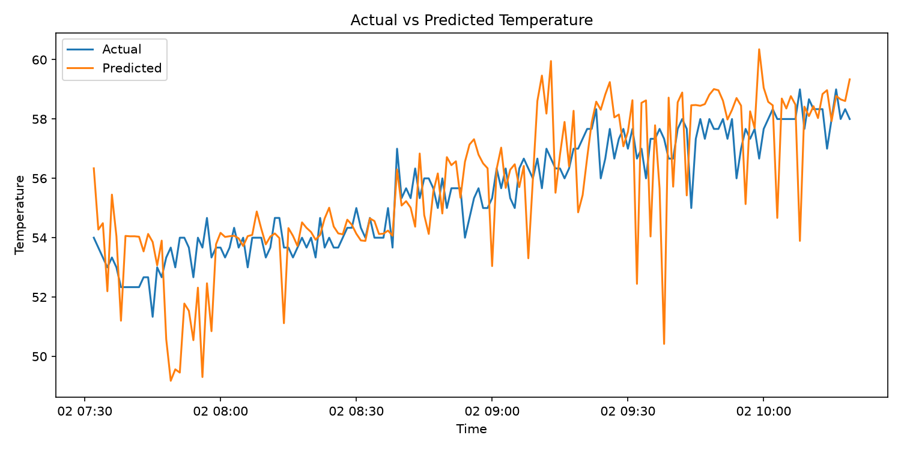

# First thermal-prediction experiment

## Objective

Predict the `p0_core0_temp` CPU-core temperature 10 minutes into the future using Marconi100 (M100) node telemetry available at the prediction timestamp.

## Data and scope

- Source: M100 ExaData / Marconi100 HPC telemetry dataset, March 2021.
- Node: `582`.
- UTC window: 2021-03-01 20:18 through 2021-03-02 10:29.
- Resolution: one-minute means from the raw, irregular 20-second and Ganglia observations.
- Complete observations: 852.

The raw dataset is retained in `data/raw/21-03`; the compact, reproducible experiment table is `data/processed/m100_node582_first_window.csv`.

## Features and target

| Role | Dataset metric / derived feature |
| --- | --- |
| Target and thermal history | `ipmi_pub/p0_core0_temp` (`temperature_c`) |
| Cross-socket thermal context | `ipmi_pub/p1_core0_temp` |
| CPU power | `ipmi_pub/p0_power`, `ipmi_pub/p1_power`, and their sum |
| CPU activity | `ganglia_pub/cpu_user`, `ganglia_pub/cpu_idle`, `ganglia_pub/load_one` |

`ganglia_pub/cpu_speed` was inspected but remains fixed at 3800 MHz in the observed records, so it has no predictive variance and is excluded from the first model.

The preprocessing step adds lagged temperature features at 1, 2, 3, and 5 minutes. The target is a 10-row (10-minute) forward shift. These lags use past data only.

## Evaluation design

Observations are sorted by timestamp and split chronologically: the earliest 80% trains the model, and the latest 20% is held out for evaluation. No random shuffling is used, preventing future telemetry from entering training.

Model: `RandomForestRegressor(n_estimators=300, min_samples_leaf=2, random_state=42)`.

## Result

| Metric | Held-out result |
| --- | ---: |
| Train rows | 669 |
| Test rows | 168 |
| Horizon | 10 minutes |
| MAE | 1.263 °C |
| RMSE | 1.702 °C |
| R² | 0.160 |

## Interpretation and next steps

The MAE shows the baseline tracks near-future core temperature reasonably for this short window, but the modest R² indicates it does not yet explain much of the variation in the held-out period. Results should not be generalized beyond this node and window.

Next steps are to add a persistence baseline, evaluate more independent node/time windows, use expanding-window validation, compare XGBoost, and define a thermal-risk threshold only after measuring the broader temperature distribution.
